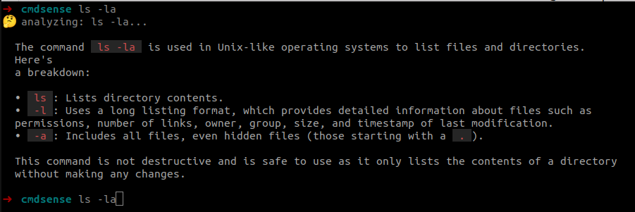
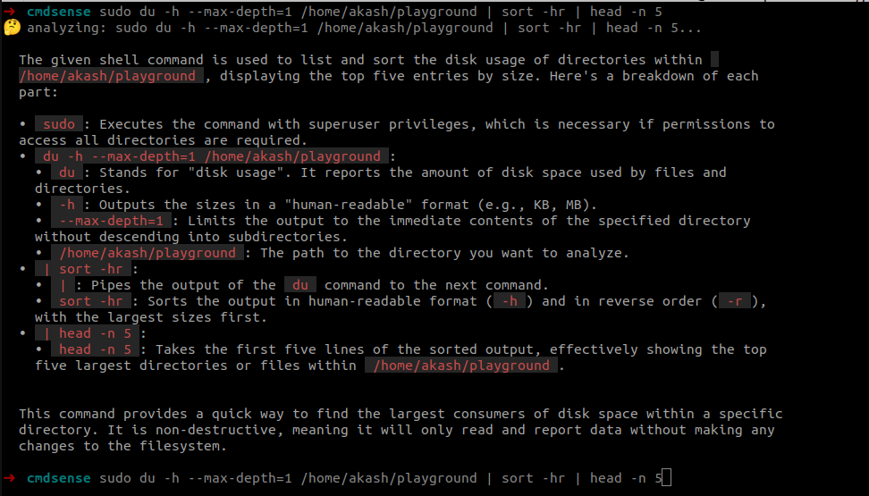

# cmdsense 🧙‍♂️

**cmdsense** is an AI-powered CLI tool that explains shell commands right in your terminal. It helps you understand complex flags, warns about destructive actions, and suggests fixes.



## Features

- 🤖 **AI Explanations**: Uses OpenAI (GPT-4o) or Ollama (Llama 3, Mistral) to explain commands.
- ⚡ **Shell Integration**: Explain the current command buffer with a customizable shortcut (default `Ctrl+g`).
- ⚠️ **Safety Warnings**: explicitly warns about destructive commands (e.g., `rm -rf`, `dd`).
- 🎨 **Markdown Output**: Beautifully rendered explanations in your terminal.

## Installation

### One-line Install (Recommended)

```bash
curl -sSL https://raw.githubusercontent.com/akash1551/cmdsense/main/install.sh | bash
```

### Manual Install

1.  Clone the repository:
    ```bash
    git clone https://github.com/akash1551/cmdsense.git
    cd cmdsense
    ```
2.  Build the binary:
    ```bash
    go build -o cmdsense .
    ```
3.  Move to PATH:
    ```bash
    sudo mv cmdsense /usr/local/bin/
    ```

## Configuration

Before using, configure an AI provider.

### Option A: OpenAI (Recommended)

```bash
cmdsense config --provider openai --openai-key "sk-..."
```

### Option B: Ollama (Local & Free)

Ensure [Ollama](https://ollama.com/) is running.

```bash
cmdsense config --provider ollama --model llama3
```

## Usage



### 1. Shell Integration (Zsh)

Add the widget to your `.zshrc` to enable the `Ctrl+g` shortcut:

```bash
# Add this to your ~/.zshrc
source <(cmdsense init zsh)
```

Now, type a command in your terminal (don't press Enter) and press **Ctrl+g**.

### 2. Shell Integration (Bash)

Add the widget to your `.bashrc` to enable the `Ctrl+g` shortcut:

```bash
# Add this to your ~/.bashrc
source <(cmdsense init bash)
```

Type a command and press **Ctrl+g**.

### 3. Manual Usage

```bash
cmdsense "tar -czvf archive.tar.gz /path/to/folder"
```

## Uninstall

To remove the tool:

```bash
sudo rm /usr/local/bin/cmdsense
rm -rf ~/.config/cmdsense
```
